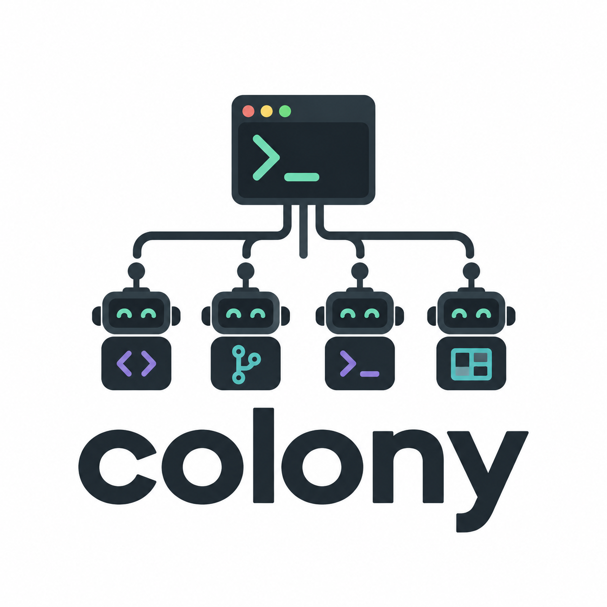

# colony

<p align="center">
  
</p>

colony is a terminal tool for parallel AI coding sessions.

Each minion gets its own git worktree, tmux session and coding agent.
Use Claude Code, Codex or OpenCode, and switch between sessions from your terminal.

## Build and run

Supports macOS and Linux on amd64 and arm64, with cgo disabled. Building requires
Go 1.22 or newer on Linux; use Go 1.25.5 or newer on current macOS.
Running minions requires git, tmux ≥ 3.2, the system `cp` command and your chosen
agent CLI on PATH. Install and authenticate the agent before spawning a minion.

```sh
make build
./bin/colony
./bin/colony version
./bin/colony --help
```

For a local install:

```sh
CGO_ENABLED=0 go install ./cmd/colony
export PATH="$(go env GOPATH)/bin:$PATH"
colony version
```

Keep that PATH entry in your shell configuration. Source builds report `dev`;
snapshot binaries include the Git commit.

## Start a minion

With a main repository at `~/projects/api` and an `origin` remote:

```sh
colony spawn --repo api --branch feat/412-fx-cache --ticket 412 --name "FX cache"
```

This fetches `origin/main` (or `origin/master` when only a local master exists),
creates and pushes the new branch, copies local artifacts, and starts Claude Code
in tmux. It switches your current tmux client, or attaches this terminal when
outside tmux. Detach with tmux's `Ctrl-b d`; the session keeps running.

Choose another agent or leave it running in the background:

```sh
colony spawn --repo api --branch feat/cache-tests --agent codex --detach
colony spawn --repo api --branch feat/cache-docs --agent opencode --detach
colony ls
colony attach 412-fx-cache
colony switch feat-cache-tests
```

`--repo` is an exact directory name under `repos_root`. The branch must be new
locally. Use letters, digits, slashes, dots, underscores and hyphens in branch
names. Worktrees are created under
`<worktrees_root>/<repo>/<branch-with-slashes-replaced-by-hyphens>`.

Minion ids use the ticket and name when supplied, otherwise the branch with
slashes replaced by hyphens. A conflicting id gets a repository prefix; the
spawn output prints the actual id and attach command.

The main checkout's files stay untouched. Local `.env` and `.env.*` files and
`graphify-out` directories are copied recursively, preserving attributes and
existing destination files. Searches exclude `.git` and `node_modules`.

When the agent exits, its pane becomes a shell. `colony ls` shows both the agent status
and whether its tmux session is **alive** or **dead**. After Claude exits, its
status is **ended** while the shell session remains alive. Manifests live in
`${XDG_STATE_HOME:-~/.local/state}/colony/minions/`. If creation fails after a
worktree has been made, colony reports the error and retains that worktree.

## Finish, adopt and resume

Retire a minion from the monitor, another tmux session, or outside tmux:

```sh
colony retire 412-fx-cache
colony retire 412-fx-cache --keep-branch
```

Retirement refuses uncommitted/untracked files and commits ahead of the local
upstream reference. Without an upstream, it checks commits beyond the base
branch. `--force` explicitly discards that work. Colony kills the tmux session,
removes the worktree, and deletes its local branch unless `--keep-branch` is set
or the branch is `main`, `master` or `develop`. Remote branches are kept.

The manifest, event log and any prompt move to `minions/archive/`, with a
retirement timestamp. Reused ids get a timestamp suffix in the archive. If
cleanup fails, the active manifest is retained so you can correct the reported
problem and retry. A main checkout or a worktree whose branch has changed is
refused even with `--force`.

Colony refuses to retire the session running the command or popup: killing that
pane would interrupt cleanup. Use the monitor or another terminal instead.

To bring an existing worktree session into colony, run from that linked
worktree inside tmux:

```sh
colony adopt --agent claude --ticket 412 --name "FX cache"
```

This records its Git state and renames the current tmux session to the minion id.
Main checkouts cannot be adopted. Existing processes keep their environment;
run the printed `export COLONY_MINION=...` command in your current shell and
restart the agent to enable reporting. New panes inherit the id automatically.
Retirement manages the whole adopted tmux session, including its other panes.

To restart a **dead** minion whose worktree still exists:

```sh
colony revive 412-fx-cache
colony attach 412-fx-cache
```

Claude resumes the latest session id recorded in its event log. Without a
recorded id, it starts fresh. Codex and OpenCode start fresh. Revive leaves the
new tmux session detached; it does not restore retired minions or deleted
worktrees. An agent that exited into a shell still has a live tmux session;
restart it in that shell, or close that session before using revive.

## Configuration

Reads `${XDG_CONFIG_HOME:-~/.config}/colony/config.toml`. Missing files/settings
use defaults. File values override defaults. `XDG_CONFIG_HOME` selects the config
directory.

To customize the roots, create that file using [config.example.toml](config.example.toml):

```toml
schema = 1
repos_root = "~/projects"
worktrees_root = "~/worktrees"
```

`~` and `~/` expand to your home directory. Loading config creates no files or
directories. Invalid TOML, incorrect field types and empty roots produce errors.
Unknown keys are ignored; missing keys, including schema, use defaults. Only
schema 1 is supported.

`colony version` and `--help` remain available even with invalid configuration.
`colony config` displays the configured roots.

## Session overview

Run `colony` to browse your minions in a terminal overview. The left list shows
**NEEDS YOU** (permission, question, ready, idle), **WORKING**, and **ENDED / DEAD**.
Waiting minions appear oldest first, with a status icon and elapsed time.
The right pane shows the request or response, repository, branch, agent, worktree
and attached terminals. Ready minions also show their commit and diff summary.
It refreshes every second, including details for the selected minion.

| Key | Action |
| --- | --- |
| ↑/↓ or j/k | Select a minion |
| Enter | Switch this tmux client, or attach from outside tmux |
| Page Up / Page Down | Scroll the details |
| x | Retire: inspect checks, then confirm; f toggles force, k keeps the branch, Esc cancels |
| r | Revive a dead minion |
| q | Close the overview |

The overview needs a terminal at least 60 columns wide and 10 rows high.
Use `colony ls` for plain text output.

### Claude status reporting

Install hooks once, with colony on PATH:

```sh
colony hooks install claude
```

The installer merges into `~/.claude/settings.json`, preserves other settings and
hooks, and backs up an existing file before changing it. Running it again makes
no changes. Restart existing Claude sessions to load the hooks. To start Claude
again in an existing minion, exit Claude and run `claude` in that same pane.
Sessions outside colony are ignored.

| State | Meaning |
| --- | --- |
| ⚠ permission | Approval needed; details show the requested tool/command |
| ? question | Claude is asking a question; details show its options |
| ✓ ready | A turn finished; details show the last response |
| ◌ idle | Session started or Claude is waiting for input |
| ● working / starting | Claude is running or the session is starting |
| ■ ended / ✗ dead | Agent exited / tmux session ended |

Use **Enter** to jump to a minion and answer Claude there. Codex and OpenCode
currently show session availability without live agent attention states.

Hooks produce no terminal output and always exit successfully. Diagnostics go to
`${XDG_STATE_HOME:-~/.local/state}/colony/report.log`; per-minion event history is
beside its manifest as `<id>.events.jsonl`. Hooks do not change manifests.

New minion sessions show their status and ticket in tmux's status bar. For
existing sessions, add this to your tmux configuration and reload it:

```tmux
set -g status-interval 2
set -g status-left-length 50
set -g status-left "#{?#{@colony_minion},#{@colony_status} #{@colony_ticket} ,}"
```

### Popup

With colony on PATH, run:

```sh
colony init
```

This creates missing configuration files and prints a `source-file` line for
your `~/.tmux.conf`. Add the line and reload your tmux configuration, then press
your tmux prefix followed by **h** to open the overview in a popup. The default
prefix is Ctrl-b. Existing config files are preserved.

### Persistent monitor

Open a separate terminal tab or window and run:

```sh
colony monitor
```

The monitor runs in the `_colony` tmux session. **Enter switches another work
tab**, keeping the monitor visible. It chooses the most recently active tmux
client outside the monitor. Press **T** to pin a work tab, or select **Automatic**
to follow activity again. If there is no work tab, open another terminal and run
`colony attach <id>`.

In the monitor, **q** detaches the terminal and leaves the overview running.
Closing the terminal also leaves it running; `colony monitor` reconnects to it.
The `_colony` session does not appear in the minion list.

The header shows per-status counts and **NEW ATTENTION** when a minion needs you.
Selecting another minion or jumping acknowledges the marker. To also ring the
terminal bell, add `monitor_bell = true` to colony's configuration, then restart
the overview process. Terminal notification behavior depends on your terminal's
bell settings.

After upgrading colony, restart an existing monitor to load the new binary
(`q` only detaches it):

```sh
tmux kill-session -t _colony
colony monitor
```

This restarts the overview; minion sessions keep running.

## Development checks

Install golangci-lint v2.14.0 and GoReleaser v2.18.2 using their official
[installation instructions](https://golangci-lint.run/docs/welcome/install/) and
[release packages](https://goreleaser.com/install/), then run:

```sh
make check     # tests, vet, lint, four OS/architecture builds
make snapshot # four release archives and checksums in dist/; no publishing
```

`GOLANGCI_LINT` and `GORELEASER` make variables may point to locally installed
tool binaries. GoReleaser needs a Git checkout with at least one commit for build
metadata. The release configuration follows the upstream
[Go builder](https://goreleaser.com/customization/builds/builders/go/) and
[snapshot workflow](https://goreleaser.com/blog/goreleaser-v2/).

CI runs tests and vet on macOS/Linux, checks the Go 1.22 minimum on Linux, lints,
cross-builds darwin/linux × amd64/arm64, and uploads snapshot archives. CI does
not publish releases. Tests require git, tmux, cp and bash. They use temporary
HOME/config/state directories, fixture repositories with local bare remotes,
fake agents and separate `tmux -L colony-test-<random>` servers. They never use
your working repositories or active tmux server. Artifact-copy tests compare
against the original wt script and a golden inventory.
