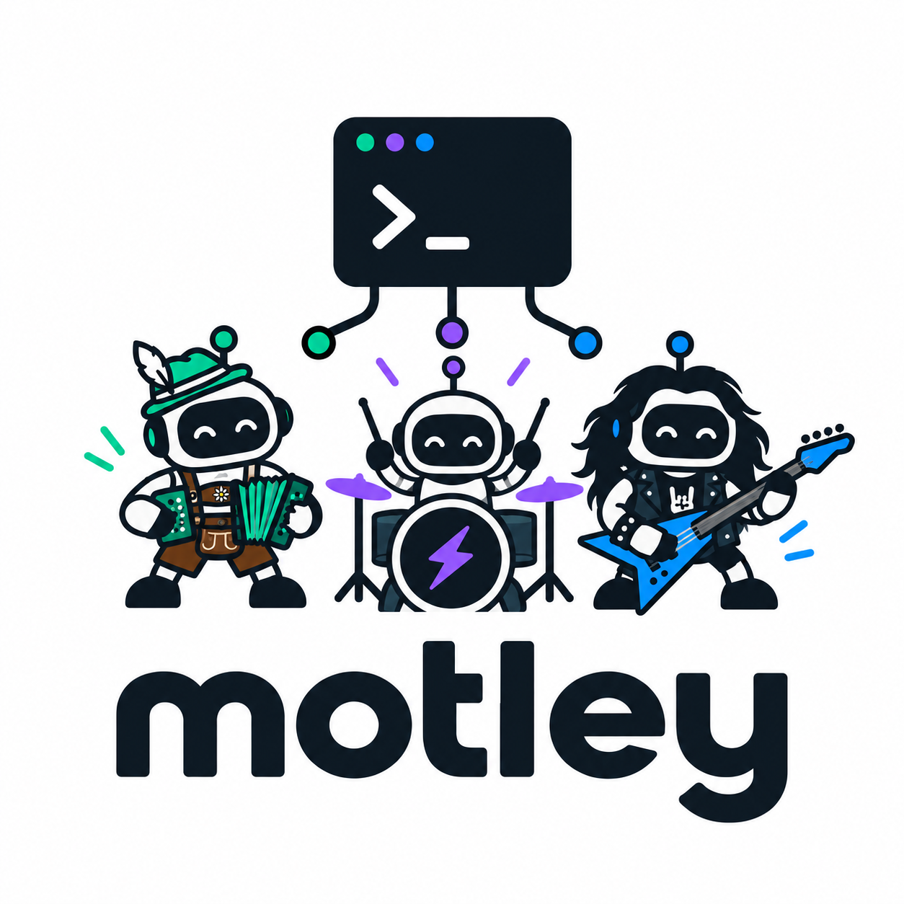

# motley

<p align="center">
  
</p>

Run Claude Code, Codex and OpenCode in parallel, each in its own Git worktree and
tmux session. Use **`motley`** or **`mtly`**.

An agent session is a **member**, a group of members is a **crew**, and its package
of work is a **gig**.

## Install

macOS or Linux, amd64 or arm64; bash, zsh or fish:

```sh
curl -fsSL https://raw.githubusercontent.com/thomashartm/motley/main/install.sh -o motley-install.sh && bash motley-install.sh
```

The installer builds from `main`, installs both commands in `~/.local/bin`, and
sets up PATH, the tmux popup and reporting for installed agents. It installs missing Git, Go and
tmux through your package manager; macOS requires Homebrew. Existing tmux must
be 3.2+ and existing Go 1.21+.

Install and authenticate your agent CLI separately. Open a new terminal and run
`mtly`. Restart agents to load hooks. In Codex, review and trust the Motley
hooks with **`/hooks`**. Rerun the installer to
upgrade.

The installer shows a short status checklist; full output is saved under
`~/.motley/install-history/`.

From a checkout:

```sh
bash install.sh --local  # install local source
make build              # build only; run ./bin/mtly
```

### Update or uninstall

Release updates require `gh` and a writable installation directory:

```sh
mtly update --check # check GitHub's latest release
mtly update         # verify checksums and replace both commands
```

Updates preserve settings and worktrees. Details go to `~/.motley/update-history/`.
Restart the monitor after updating.

To uninstall (requires Python 3):

```sh
curl -fsSL https://raw.githubusercontent.com/thomashartm/motley/main/uninstall.sh -o motley-uninstall.sh && bash motley-uninstall.sh
```

From a checkout or release archive, run `bash uninstall.sh`. It removes the
commands installed in `~/.local/bin` and disconnects agent hooks and the tmux
popup. Settings, shared PATH entries, worktrees, branches and running sessions
stay intact. Restart agents and tmux after your sessions finish. Full output
and backup paths are saved under `~/.motley/uninstall-history/`.

## Start working

Keep main repositories under `~/projects`; worktrees go under `~/worktrees`.
Repositories need an `origin` remote and a local `main` or `master` branch.

Run `mtly`, press **s**, choose a repository and agent, then review and launch.
**Launching creates and pushes a new branch.** Your main checkout stays intact.
Press **Enter** to attach; **Ctrl-b d** detaches without stopping the session.

Or use the CLI:

```sh
mtly spawn --repo api --branch feat/412-fx-cache --ticket 412 --name "FX cache" --agent codex
mtly ls
mtly attach 412-fx-cache
```

`--repo` names a directory under the repository root. Add `--detach` to launch in
the background. Claude is the default agent. Local `.env`, `.env.*` and
`graphify-out` artifacts are copied into the worktree.

## Overview

| Key | Action |
| --- | --- |
| ↑/↓ or j/k | Select a member, option or field |
| → / ← | Move from list to details to Actions, or back |
| Enter | Attach or switch to it |
| s | Spawn a member |
| i | Send a reply |
| t | Send the member to another work tab |
| / | Filter members |
| g | Group by attention, crew or repository |
| e | Edit member details |
| G | Manage crews |
| x / r | Retire / revive |
| Page Up / Page Down | Scroll details |
| q | Close |

Press **→** twice from the list to open **Actions**, then **↑/↓** and **Enter**
to edit a member, manage crews or spawn. Editors use **↑/↓** to move through
fields, **Save** and **Cancel**; **Enter** activates and **Esc** cancels. **←/→**
move the text cursor while editing. **Tab/Shift-Tab** and **Ctrl-s** still work.

In crew view, the first **→** expands a crew; the next enters its member table.
**←/Esc** returns to the list, where **←** collapses the crew. **Tab** also enters
the table; **H** shows inactive crews. In the crew manager, **→** opens its actions.

### Inside an agent's tmux session

With the default tmux prefix, press **Ctrl-b**, release both keys, then press
the next key. Use your own prefix if you changed it.

- **Details:** **Ctrl-b h** opens Motley. Select a member with **↑/↓**, then
  **→** focuses its details. Scroll with **↑/↓** or **Page Up/Page Down**;
  **←/Esc** returns to the list.
- **Back to the agent:** **q** closes the popup. **Enter** switches to the
  selected member instead.
- **Other tmux windows/panes:** **Ctrl-b w** opens the window picker;
  **Ctrl-b n/p** selects the next/previous window; **Ctrl-b arrow** selects a pane.
- **Scrollback:** **Ctrl-b [**, then arrows or **Page Up/Page Down**;
  **q** leaves scrollback.
- **Detach:** **Ctrl-b d** returns to your shell and keeps the agent running.

### Open the agent in another Ghostty tab

1. Press **Cmd-T** in Ghostty on macOS to open a tab (default shortcut).
2. Run `mtly ls` to find the member ID, then `mtly attach <id>` in that tab.
   This attaches to the existing session; it does not start another agent.
3. To move rather than share the view, detach the original tab with **Ctrl-b d**.

Motley's **t** sends a member to an already attached work tab; it does not create
a Ghostty tab. Ghostty shortcuts are [configurable](https://ghostty.org/docs/config/keybind).

For a persistent overview in a separate tab, run
`mtly monitor`: **Enter** switches another work tab, **T** chooses that tab, and
**q** detaches the monitor. After upgrading, restart it with
`tmux kill-session -t _motley`, then `mtly monitor`.

Claude, Codex and OpenCode report working, permission, question and ready states.
Jump into the agent for permission requests. To set up reporting individually:

```sh
mtly hooks install claude
mtly hooks install codex
mtly hooks install opencode
```

Restart the agent afterward. Codex requires native hooks (verified with 0.159.2)
and trust approval through **`/hooks`**; Motley preserves its approval settings.
OpenCode uses a plugin (verified with 1.18.21). Hooks are silent outside Motley.

## Crews and gigs

```sh
mtly crew add --title "Banking" --gig "Ship FX caching" --color blue
mtly crew assign 412-fx-cache banking
mtly crew list
mtly crew edit banking --gig "Roll out payments"
```

Use `--crew banking` when spawning or adopting. Members inherit their crew's
colour unless overridden. Crews support an optional `--url`; `--gig ""` clears
the gig. Use `crew assign <member> none` to unassign a member.

## Finish or resume

```sh
mtly retire 412-fx-cache               # remove session, worktree and local branch
mtly retire 412-fx-cache --keep-branch # retain the local branch
mtly revive 412-fx-cache               # restart a dead session, then attach
```

Retire from another session or the monitor. It refuses unsaved or unpushed work;
`--force` discards that work. Remote branches remain. Revive requires the
worktree to exist and cannot restore retired members. Claude resumes its last
recorded session, as do Codex and OpenCode when reporting captured a session id.
Without a recorded id, the agent starts fresh. If the agent exited but its tmux
shell is still alive, restart the agent in that shell instead.

To adopt an existing linked worktree, run inside its tmux session:

```sh
mtly adopt --agent claude --name "FX cache"
```

Follow the printed environment and restart instructions. Adoption manages the
whole tmux session, including its other panes.

## Blueprints

Blueprints supply initial prompts. Put Markdown templates in
`~/.config/motley/blueprints/` or the main repository's `.motley/blueprints/`.
Repository templates take precedence. Start with
[feature-plan-first.md](examples/blueprints/feature-plan-first.md).

```sh
mtly blueprint list --repo api
mtly blueprint validate --repo api
mtly spawn --repo api --branch feat/example --blueprint feature-plan-first --var 'constraints=Keep it small'
```

The spawn form also lets you choose a blueprint and edit its prompt in `$EDITOR`.
Revive keeps agent arguments without replaying the initial prompt.

## Configuration

Edit `~/.config/motley/config.toml`:

```toml
schema = 1
repos_root = "~/projects"
worktrees_root = "~/worktrees"
```

`mtly config` shows the roots. State lives in `~/.local/state/motley`.
`XDG_CONFIG_HOME` and `XDG_STATE_HOME` override these locations. For an earlier
pre-v1 setup, copy configuration and blueprints into the new directories and
adopt existing sessions. Manual builds can use `mtly init` to create config and
print the tmux popup setup instructions.

## Development

Requires Go 1.22+, Git, tmux, cp, bash, Python 3 and Node 24 for plugin tests;
golangci-lint 2.14.0 and GoReleaser
2.18.2 for the full checks.

```sh
make test     # install/uninstall, plugin and Go tests
make check    # tests, vet, lint, macOS/Linux builds for amd64/arm64
make snapshot # release archives in dist/; no publishing
```

Tests use temporary repositories, fake agents and isolated tmux servers.
Set `GOLANGCI_LINT` or `GORELEASER` to use tools outside PATH.
Delivery status is tracked in [DELIVERY.md](DELIVERY.md).
